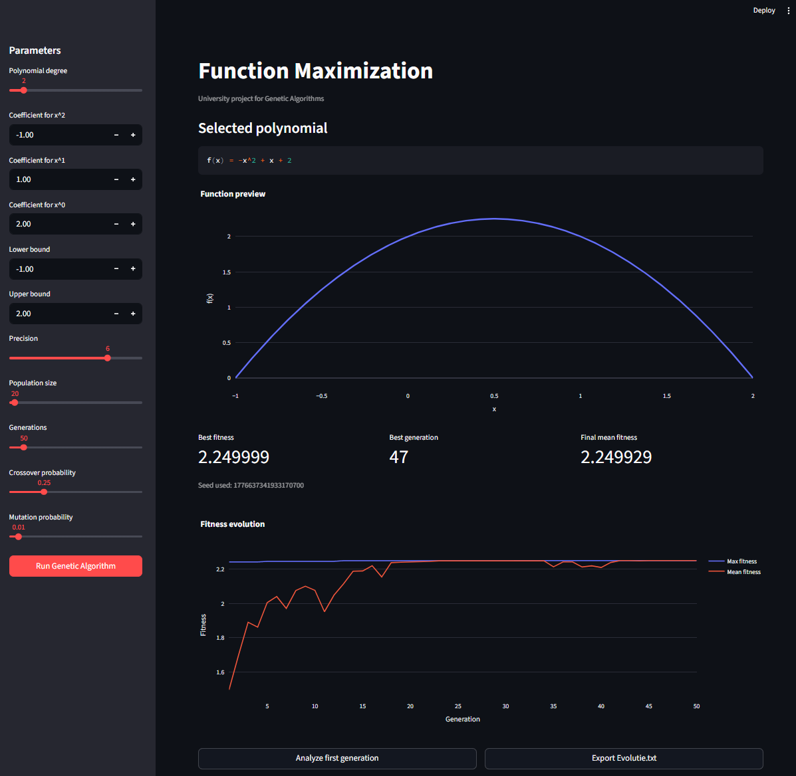

# Genetic Algotithms - Function Maximization
> Vlad Minciunescu ~ 251 | University of Bucharest

## Basicly,

- The maximum of a polynomial is approximated using a genetic algorithm.
- [**app.py**](/app.py) contains the interface written with Streamlit and Plotly, while [**genetic.py**](/genetic.py) has the algorithm's implementation and logging system. _This is the only one file containing generated code._

## Requirements

- Python, [Makefile](https://www.gnu.org/software/make/manual/make.html)

## Run

- Download Python dependencies using `make dependencies`
- Then run it by `make magic`

## Preview

